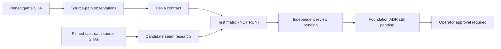

# WO-000A evidence and review dependency graph

```mermaid
flowchart LR
  PIN["Pinned game SHA"] --> FILES["Source-path observations"]
  FILES --> CONTRACT["Tier-A contract"]
  CONTRACT --> PLAN["Test matrix (NOT RUN)"]
  UP["Pinned upstream source SHAs"] --> SEAMS["Candidate seam research"]
  SEAMS --> PLAN
  PLAN --> REVIEW["Independent review pending"]
  REVIEW --> ADR["Foundation ADR still pending"]
  ADR --> OP["Operator approval required"]
```

Read-only source checks are evidence; acceptance requires verification and user authorization. This diagram does not confer permission to implement.
