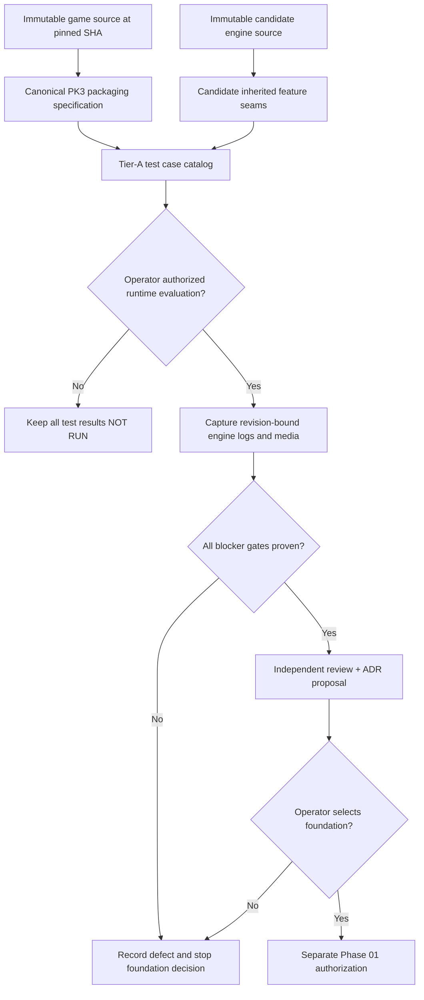

# SNE-WO-000C — Traceability flow

```mermaid
flowchart TD
    G[Immutable game source at pinned SHA] --> B[Canonical PK3 packaging specification]
    U[Immutable candidate engine source] --> E[Candidate inherited feature seams]
    B --> T[Tier-A test case catalog]
    E --> T
    T --> A{Operator authorized runtime evaluation?}
    A -->|No| H[Keep all test results NOT RUN]
    A -->|Yes| R[Capture revision-bound engine logs and media]
    R --> P{All blocker gates proven?}
    P -->|No| X[Record defect and stop foundation decision]
    P -->|Yes| D[Independent review + ADR proposal]
    D --> O{Operator selects foundation?}
    O -->|No| X
    O -->|Yes| F[Separate Phase 01 authorization]
```

The flow is **proposal**, not completed CI or executable code. Fork candidate remains UNSELECTED.
