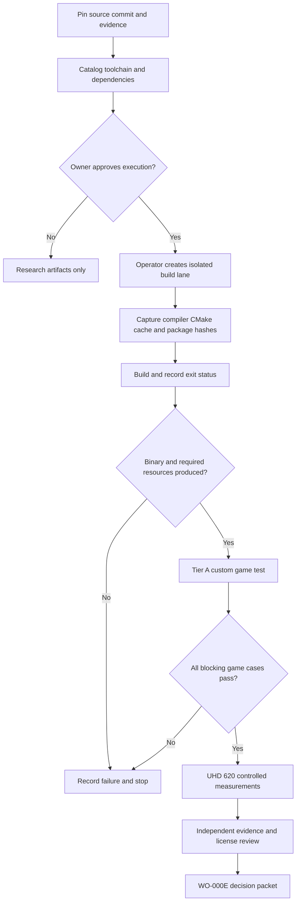

# SNE-WO-000D — Proposed reproducibility sequence

```mermaid
flowchart TD
    A[Pin source commit and evidence] --> B[Catalog toolchain and dependencies]
    B --> C{Owner approves execution?}
    C -->|No| D[Research artifacts only]
    C -->|Yes| E[Operator creates isolated build lane]
    E --> F[Capture compiler CMake cache and package hashes]
    F --> G[Build and record exit status]
    G --> H{Binary and required resources produced?}
    H -->|No| I[Record failure and stop]
    H -->|Yes| J[Tier A custom game test]
    J --> K{All blocking game cases pass?}
    K -->|No| I
    K -->|Yes| L[UHD 620 controlled measurements]
    L --> M[Independent evidence and license review]
    M --> N[WO-000E decision packet]
```

The diagram defines future permissions, not tasks executed by WO-000D.
