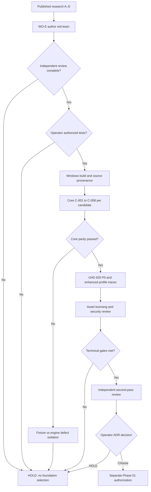

# WO-E — Gate dependency diagram

```mermaid
flowchart TD
    A[Published research A–D] --> B[WO-E author red-team]
    B --> C{Independent review complete?}
    C -- No --> H[HOLD: no foundation selection]
    C -- Yes --> D{Operator authorized tests?}
    D -- No --> H
    D -- Yes --> E[Windows build and source provenance]
    E --> F[Core C-001 to C-008 per candidate]
    F --> G{Core parity passed?}
    G -- No --> I[Fixture vs engine defect isolation]
    I --> H
    G -- Yes --> J[UHD 620 P0 and enhanced profile traces]
    J --> K[Asset licensing and security review]
    K --> L{Technical gates met?}
    L -- No --> H
    L -- Yes --> M[Independent second-pass review]
    M --> N{Operator ADR decision}
    N -- HOLD --> H
    N -- Choose --> O[Separate Phase 01 authorization]
```

Graph describes a *plan*, not executed checks. A future runner may implement authorized testing separately.
