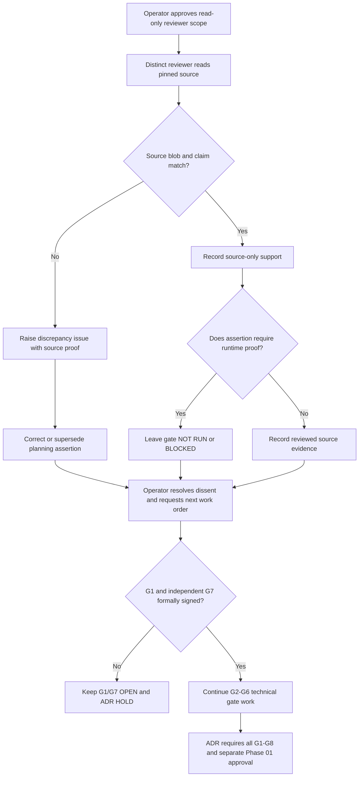

# F-00 — Review workflow (Mermaid blueprint)

```mermaid
flowchart TD
    A[Operator approves read-only reviewer scope] --> B[Distinct reviewer reads pinned source]
    B --> C{Source blob and claim match?}
    C -->|No| D[Raise discrepancy issue with source proof]
    C -->|Yes| E[Record source-only support]
    D --> F[Correct or supersede planning assertion]
    E --> G{Does assertion require runtime proof?}
    G -->|Yes| H[Leave gate NOT RUN or BLOCKED]
    G -->|No| I[Record reviewed source evidence]
    F --> J[Operator resolves dissent and requests next work order]
    H --> J
    I --> J
    J --> K{G1 and independent G7 formally signed?}
    K -->|No| L[Keep G1/G7 OPEN and ADR HOLD]
    K -->|Yes| M[Continue G2-G6 technical gate work]
    M --> N[ADR requires all G1-G8 and separate Phase 01 approval]
```

The diagram depicts a future review. It is **not** a runtime, system-action or authorization workflow automatically executed by the ZIP.
